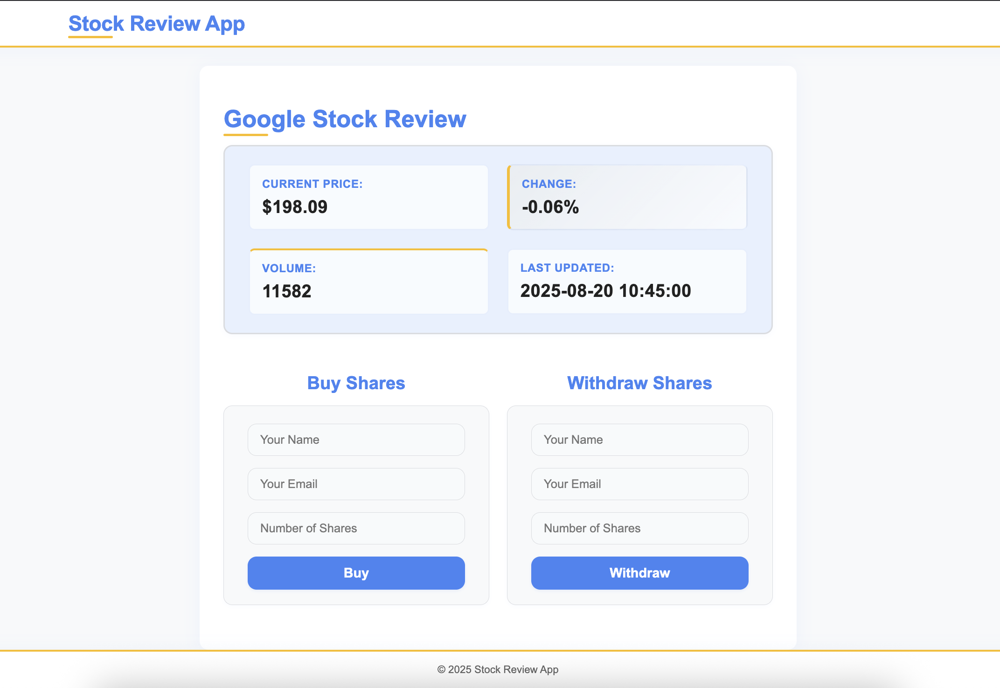

# Stock Review App




## Features

- Displays real-time Google (GOOG) stock info
- Users can submit buy/withdraw share requests
- Requests stored in MySQL
- Clean, responsive UI
  
## 🛠️ Technologies

- **Backend**: PHP 8.1+
- **Database**: MySQL
- **Frontend**: HTML5, CSS3, JavaScript
- **API**: TwelveData
- **Server**: Apache (XAMPP)
- **Dependencies**: Composer, vlucas/phpdotenv

## Setup (macOS, XAMPP)

1. **Clone repo** to `~/Applications/XAMPP/htdocs/stock-app`

2. **Install Composer** (if not already installed) Follow - 'https://github.com/vlucas/phpdotenv'
   ```bash
   curl -sS https://getcomposer.org/installer | php
   sudo mv composer.phar /usr/local/bin/composer
   sudo chmod +x /usr/local/bin/composer
   ```

3. **Install Dependencies**
   ```bash
   cd /Applications/XAMPP/htdocs/stock-app
   composer install
   ```

4. **Environment Configuration**
   - Copy `.env.example` to `.env`
   - Update `.env` with your API keys and database credentials:
   ```bash
   cp .env.example .env
   ```
   - Edit `.env` file with your actual values:
     - `TWELVEDATA_API_KEY`: Your TwelveData API key
     - `DB_NAME`: Your database name (default: stock_app)
     - Other API keys if needed

5. **Create DB and Table**  
   - In phpMyAdmin, run the SQL from the requirements

6. **Start XAMPP** 
   ```bash
   sudo /Applications/XAMPP/xamppfiles/xampp start
   ```

7. **Browse** to `http://localhost/stock-app/`

## 📦 Dependencies

This project uses Composer for dependency management:

- **vlucas/phpdotenv**: Environment variable management for secure configuration

### Installing Dependencies
```bash
composer install
```

### Environment Variables
The application uses a `.env` file for configuration. Key variables include:

- `TWELVEDATA_API_KEY`: API key for stock data
- `STOCK_SYMBOL`: Stock symbol to track (default: GOOG)
- `STOCK_INTERVAL`: Data interval (default: 30min)
- `DB_HOST`, `DB_NAME`, `DB_USER`, `DB_PASS`: Database configuration

## Security Notes

- All input is validated server and client side.
- Uses PDO prepared statements to prevent SQL injection.

# stock-review-app
